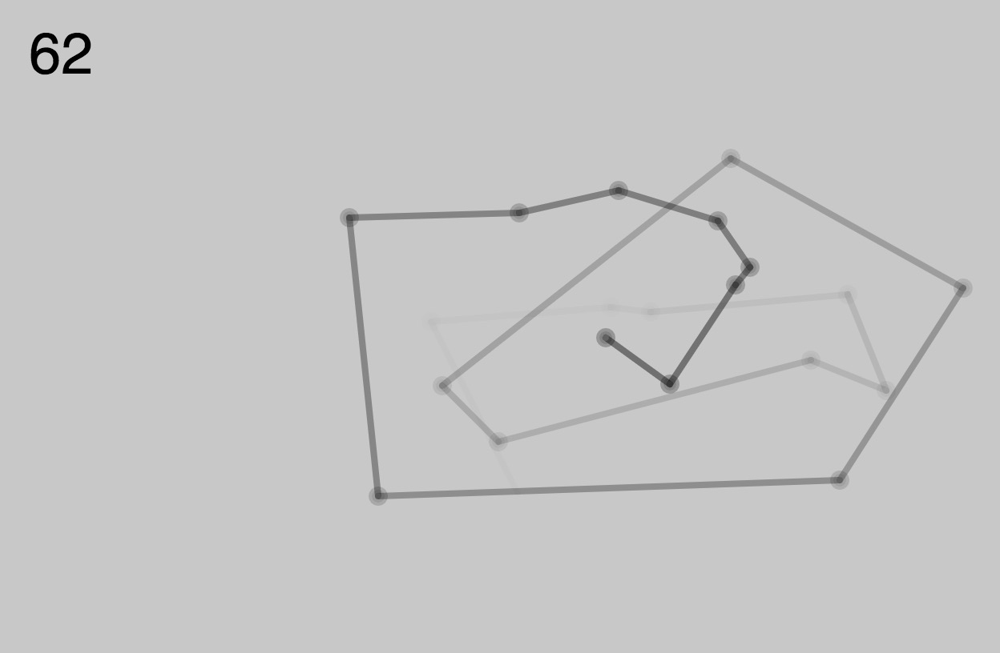
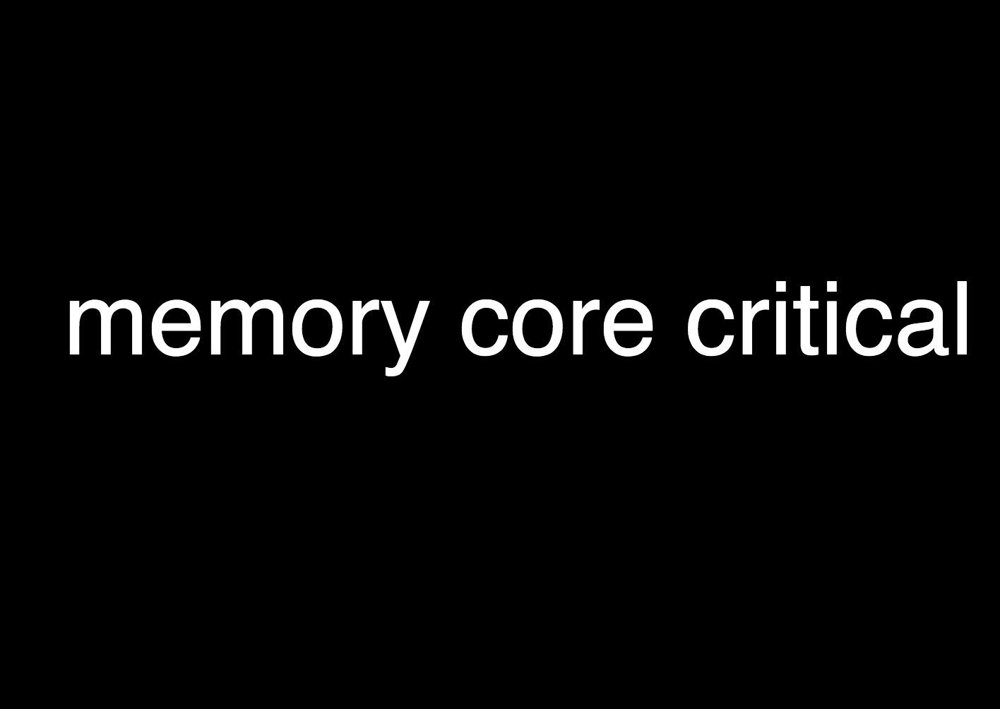
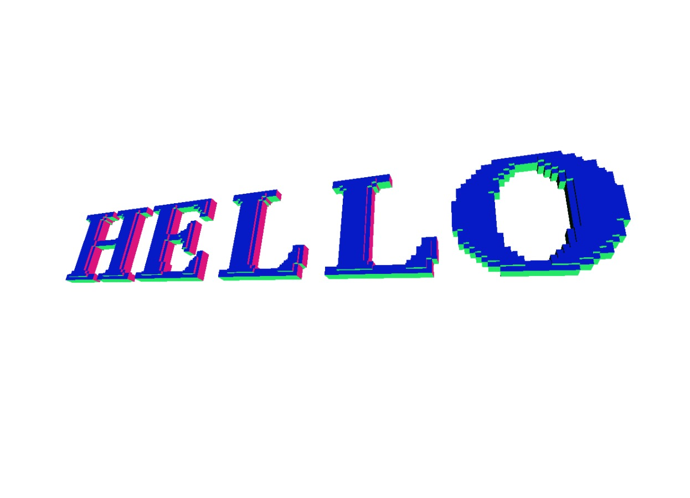

# P5js is Processing for Web & some P5js helper codes
### Tutorial transition from Processing to P5js https://github.com/processing/p5.js/wiki/Processing-transition
### Extra libraries to extend P5js : https://p5js.org/libraries/
| In&nbsp;action&nbsp;&nbsp;&nbsp;&nbsp;&nbsp;&nbsp;&nbsp;&nbsp;&nbsp; | Description | [P5 js Library](https://p5js.org/libraries/) | Possible use / demo | Example Sketch/folder |
| ----------------- | ------------- | ------------- | ------------- | ------------- |
| <a href= "https://karenanndonnachie.github.io/Slave-To-The-Algorithm/P5js/poseNet_test" target="_blank"><a/> | Motion / Pose | poseNet  | Motion Tracking | <a href="poseNet_test/" target="_blank">poseNet/</a> |
|  | Sound In / Out / Volume etc | [P5.sound.js](https://p5js.org/reference/#/libraries/p5.sound) | Play music / analyse sound | <a href="P5js_soundTest/" target="_blank">soundTest/</a> |
|  | Paragraph text | [P5 js](https://p5js.org/reference/) | Import text / animate as wave | <a href="TextParaMobyDick/" target="_blank">TextParaMobyDick/</a> |
|  | Import Fonts & Animate text | [P5 js](https://p5js.org/reference/)  | Translate/Rotate animate / map() function | <a href="CODEWORDS13aug/" target="_blank">spinnyText/</a> |
|  | Lots of wiggly letters all over... | [P5 js](https://p5js.org/reference/) + [custom Class](https://p5js.org/reference/#/p5/class) | Fill Window with text, erase with mouse | <a href="randomLettersErase/" target="_blank">randomLettersErase/</a> |
|  | Draw with Vectors & count points | [P5 js](https://p5js.org/reference/) + [custom Class](https://p5js.org/reference/#/p5/class) | Drawing app that tracks "complexity" | <a href="doodleVector_p5js/" target="_blank">doodleVector_p5js/</a> |
|  | Speech to Text from microphone | [P5 Speech library](https://idmnyu.github.io/p5.js-speech/) | Uses microphone as input, writes text to screen. Can also do the inverse (ie. read a text) | <a href="p5Speech_singleLineContinuous/" target="_blank">p5Speech_singleLineContinuous/</a> |
| <a href="https://github.com/FreddieRa/p5.3D/wiki/Word3D" target="_blank"> | 3D TEXT with WEBGL P5js | [Github Repo](https://github.com/FreddieRa/p5.3D/wiki/Word3D) | Can make words, shapes and more in 3D with WEBGL | no demo | 
## Mouse Events
Working with mouse events using p5js is easy. We can create sketches that do various things based on the mouse's position on the screen or when the mouse button is pressed, 
etc. Here is a list of the mouse related functions in p5js:
<ul> 
	<li><a href="http://p5js.org/reference/#/p5/mouseX">mouseX</a></li>
	<li><a href="http://p5js.org/reference/#/p5/mouseY">mouseY</a></li>
	<li><a href="http://p5js.org/reference/#/p5/pmouseX">pmouseX</a></li>
	<li><a href="http://p5js.org/reference/#/p5/pmouseY">pmouseY</a></li>
	<li><a href="http://p5js.org/reference/#/p5/winMouseX">winMouseX</a></li>
	<li><a href="http://p5js.org/reference/#/p5/winMouseY">winMouseY</a></li>
	<li><a href="http://p5js.org/reference/#/p5/pwinMouseX">pwinMouseX</a></li>
	<li><a href="http://p5js.org/reference/#/p5/pwinMouseY">pwinMouseY</a></li>
	<li><a href="http://p5js.org/reference/#/p5/mouseButton">mouseButton</a></li>
	<li><a href="http://p5js.org/reference/#/p5/mouseIsPressed">mouseIsPressed</a></li>
	<li><a href="http://p5js.org/reference/#/p5/mouseMoved">mouseMoved()</a></li>
	<li><a href="http://p5js.org/reference/#/p5/mouseDragged">mouseDragged()</a></li>
	<li><a href="http://p5js.org/reference/#/p5/mousePressed">mousePressed()</a></li>
	<li><a href="http://p5js.org/reference/#/p5/mouseReleased">mouseReleased()</a></li>
	<li><a href="http://p5js.org/reference/#/p5/mouseClicked">mouseClicked()</a></li>
	<li><a href="http://p5js.org/reference/#/p5/mouseWheel">mouseWheel()</a></li>
</ul>

## Touch events
<ul>
	<li><a href="http://p5js.org/reference/#/p5/touchX">touchX</a></li>
	<li><a href="http://p5js.org/reference/#/p5/touchY">touchY</a></li>
    <li><a href="http://p5js.org/reference/#/p5/touches[]">touches[]</a></li>
    <li><a href="http://p5js.org/reference/#/p5/touchStarted">touchStarted()</a></li>
    <li><a href="http://p5js.org/reference/#/p5/touchMoved">touchMoved()</a></li>
    <li><a href="http://p5js.org/reference/#/p5/touchEnded">touchEnded()</a></li>
	<li><a href="https://p5js.org/reference/#/p5/deviceShaken">deviceShaken()</a></li>	    
</ul>
## Example of deviceShaken()
<pre><code> 
// Run this example on a mobile device
// Shake the device to change the value.

let value = 0;
function draw() {
  fill(value);
  rect(25, 25, 50, 50);
}
function deviceShaken() {
  value = value + 5;
  if (value > 255) {
    value = 0;
  }
}
</code></pre>
## Example of Keyboard functions
<pre>
function keyPressed()
{
  // UP key
  if(keyCode == UP_ARROW)
  {
    ypos = ypos - numPixels; 
  }
 
  // DOWN key
  if(keyCode == DOWN_ARROW)
  { 
    ypos = ypos + numPixels; 
  }
 
  // RIGHT key
  if(keyCode == RIGHT_ARROW)
  {
    xpos = xpos + numPixels; 
  }
 
  // LEFT key
  if(keyCode == LEFT_ARROW)
  {
    xpos = xpos - numPixels; 
  }
}
</pre>

# P5.play :  a library for p5.js for animation, gaming and using sprites
Paolo Pedercini's p5.play Library: http://molleindustria.github.io/p5.play/  
Allison Parrish explains it all : https://creative-coding.decontextualize.com/making-games-with-p5-play/

## Starter Notes:
# Using sprites for animation/games in P5js
Sprites are useful when you have repeated graphics or character, objects, etc..
Please see here for the entire tutorial: https://creative-coding.decontextualize.com/making-games-with-p5-play/

Creating a sprite in p5.play is accomplished using the createSprite() function. This function returns a sprite object, which itself has a number of attributes and methods that allow us to query and change properties of the sprite.
Here’s a simple example that creates a single sprite:
<pre>var spr;
function setup() {
  createCanvas(400, 400);
  spr = createSprite(
    width/2, height/2, 40, 40);
  spr.shapeColor = color(255);
  spr.velocity.y = 0.5;
}
function draw() {
  background(50);
  drawSprites();
}
function mousePressed() {
  spr.position.x = mouseX;
  spr.position.y = mouseY;
}</pre>

## Multiple sprites
You can call the createSprite() function as many times as you want to! The p5.play framework keeps track of all the sprites you’ve added behind the scenes (so you don’t need to create your own data structure to store them). In the following example, I’ve written some code in mousePressed() that creates a new sprite whenever the user clicks the mouse:

## For example.... Using sprites in groups
<pre>var clouds;
var birds;
function setup() {
  createCanvas(400, 400);
  clouds = new Group();
  birds = new Group();

  for (var i = 0; i < 10; i++) {
    var c = createSprite(
      random(width), random(height),
      random(25, 100), random(25, 100));
    c.shapeColor = color(random(200, 255));
    clouds.add(c);
  }
  for (var i = 0; i < 5; i++) {
    var b = createSprite(
      random(width), random(height),
      random(10, 50), random(5, 25));
    b.shapeColor = color(255, 0, random(255));
    b.friction = random(0.97, 0.99);
    b.maxSpeed = random(1, 4);
    b.rotateToDirection = true;
    birds.add(b);
  }
}
function draw() {
  background(0, 150, 240);
  for (var i = 0; i < clouds.length; i++) {
    clouds[i].position.x += clouds[i].width * 0.01;
    if (clouds[i].position.x > width) {
      clouds[i].position.x = 0;
    }
  }
  for (var i = 0; i < birds.length; i++) {
    birds[i].attractionPoint(0.2, mouseX, mouseY);
  }
  drawSprites();
}</pre>

