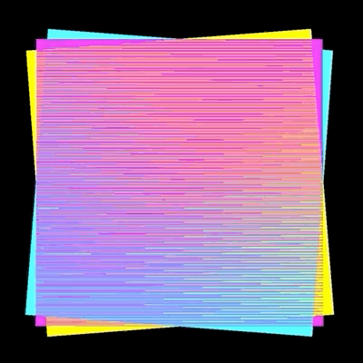

Kim Albrecht, Distinction machine rectangles CMY

# Slave-To-The-Algorithm
Studio-related & useful code
This Repository is for students and studio colleagues to find, store and share code for Slave To The Algorithm.

## Processing
In this folder you will find useful contributions, snippets and references for the Processing Environment (Java Mode)

## P5js
In this folder you will find useful contributions, snippets and references for Processing p5js Mode (Processing for the web)

## Python
In this folder you will find useful contributions, snippets and references for Python coding

## Javascript/CSS/HTML
In this folder you will find useful contributions, snippets and references for Javascript/CSS & HTML coding
